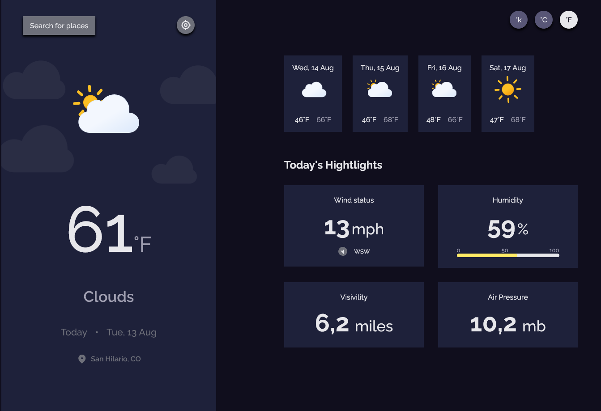

# Dev challenges - Weather app

This is a solution to the [Weather app](https://legacy.devchallenges.io/challenges/mM1UIenRhK808W8qmLWv). devChallenges challenges help you improve your coding skills by building realistic projects. 

## Overview

### Links

- Solution URL: [Code solution](https://github.com/esteban2368/weather-app)
- Live Site URL: [Live site](https://wiki-cat-challenge.vercel.app/)

### Built with

- Semantic HTML5 markup
- Modules CSS
- Flexbox
- [Typescript](https://www.typescriptlang.org/) - JavaScript with syntax for types 
- [NextJS](https://nextjs.org/) - React framework 
- [ReactJS](https://react.dev/) - Library javascript for web user interfaces
- [Google Symbols](https://fonts.google.com/icons) - Font icons
- [Sass](https://sass-lang.com/) - Preprocesador CSS
- [Framer Motion](https://www.framer.com/motion/) - Animarion Library for ReactJS
- [SWR](https://swr.vercel.app/es-ES) - React hooks for data fetching